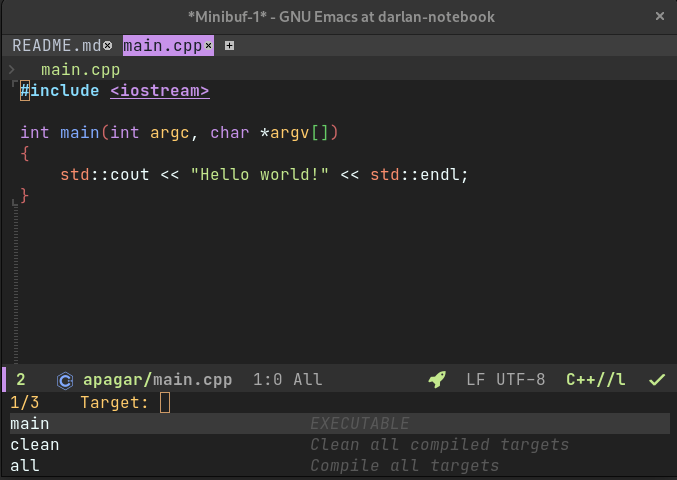
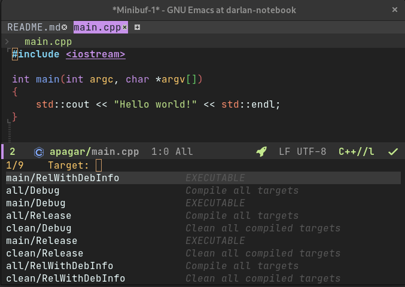

# cmake-integration


Integrates Emacs with CMake such that one can easily choose a target to compile and run.


In the simplest case, one can use Emacs' native `compile` command to compile a project. However, you still need to manually type the command to use in order to compile your code.

If you're using Emacs' native project functionality (or the projectile package) there is also a function to "compile a project". But all that it helps is running the compile command from the project root folder and you still have to type the compile command.


For C++ code using CMake, this package provide the compile command for you by querying CMake using its [file API](https://cmake.org/cmake/help/latest/manual/cmake-file-api.7.html). That is, with a simply keybinding Emacs can query (with completion) you for the target name to compile and just do the right thing.


# Installation

At the moment the package is available in [GitHub](https://github.com/darcamo/cmake-integration). You can just download the `cmake-integration.el` file there and put somewhere where Emacs can find it. Alternatively, you can use something like [straight](https://github.com/raxod502/straight.el), which can directly install packages from a git repository.


# Usage

Just bind `cmake-integration-save-and-compile` to a key to get
completions for a target name to compile. Once this function is
called, it will save and the chosen target. Call
`cmake-integration-save-and-compile-last-target` to recompile the last
target.


In order to run the last target (if it is an executable), call
`cmake-integration-run-last-target`. If you need to specify command
line parameters to your executable, call
`cmake-integration-run-last-target-with-arguments` instead.

**Note**: calling `cmake-integration-run-last-target` after
`cmake-integration-run-last-target-with-arguments` will run the
executable using the last specified command line parameters.

**Note**: You need to call `cmake-integration-cmake-reconfigure` or
`cmake-integration-cmake-configure-with-preset` at least once, such
that an "special empty file" is created inside the build folder to
access CMake file API. Without this you will not get completions for
the compile targets.

# Configuring CMake

By default, cmake-integration assumes the build folder to be "build". If your build folder is different, change the value of the `cmake-integration-build-dir` variable accordingly.

You might also use CMake configure presets instead. If you project is using CMake presets call the `cmake-integration-cmake-configure-with-preset` function. It will read the presets file to gather the names of all configure presets and ask you which one to use (with completions). It will then use the value of the "binaryDir" field of the chosen preset is the build folder (and ignore the value of the `cmake-integration-build-dir` variable). If the configure preset does not have a "binaryDir" field, but inherits from another preset, if will use the "binaryDir" field of the parent preset. Note that if the configure preset has a "displayName" it will be shown during completion as annotation.

## Current Limitation when using presets

At the moment if you have a configure preset called "X" you also need
to have a configure preset called "X". The reason for this is that
when configuring, the list of preset names is read from the *configure
presets*. When building, the same name is used as the *build preset*
name.

# Configuration

All you need is binding the relevant functions to desired keys. The code below is an example where "Fx" calls the function without querying and "M-Fx" call the function with querying.

```emacs-lisp
(use-package cmake-integration
  :bind (:map c++-mode-map
              ([M-f9] . cmake-integration-save-and-compile) ;; Ask for the target name and compile it
              ([f9] . cmake-integration-save-and-compile-last-target) ;; Recompile the last target
              ([M-f10] . cmake-integration-run-last-target-with-arguments) ;; Ask for command line parameters to run the program
              ([f10] . cmake-integration-run-last-target) ;; Run the program (possible using the last command line parameters)
              ([M-f8] . cmake-integration-cmake-configure-with-preset) ;; Ask for a preset name and call CMake
              ([f8] . cmake-integration-cmake-reconfigure) ;; Call CMake with the last chosen preset
              )
  )
```

# Project Configuration

Emacs standard project infrastructure is used in cmake-integration to
get the project root folder when finding the correct build folder.
There is nothing you need to do to configure this. However, the
`project`built-in package only uses version control to find the
project root. If you want to use a sub-folder in a repository as the
project root, or if you are not using version control, you can extend
the built-in project as described
[here](https://www.manueluberti.eu/emacs/2020/11/14/extending-project/)
in order to make Emacs recognize a folder containing an empty file
with a pre-determined name.

# Calling gdb with a target

You can debug a given executable target in gdb by calling
`cmake-integration-debug-last-target`. The current command line
arguments (if any) is passed to the executable in the debugger, and
the working directory is also set according with the value of the
`cmake-integration-run-working-directory` variable.

# Screenshots

**Disclaimer**: using
[doom-material-dark](https://github.com/doomemacs/themes) theme, as
well as the [vertico](https://github.com/minad/vertico) and
[marginalia](https://github.com/minad/marginalia) packages for
completion.


When you run `cmake-integration-cmake-configure-with-preset` you get
completions to choose the desired configure preset, also including a
"No Preset" option. The preset `displayName`, if any, is shown as an
annotation. As an example, if you have a "default" and a
"ninjamulticonfig" presets, you can get something similar to the image
below during completion.


Likewise, when you call `cmake-integration-save-and-compile` you get
completions when choosing a target name, which can give you something
like



or like (when using Ninja Multi-Config generator).



Note that targets "all" and "clean" are always included, and the
target type (executable or library) is indicated as an annotation.


# Integration with the conan package manager

When calling either `cmake-integration-cmake-configure-with-preset` or
`cmake-integration-cmake-reconfigure`, if a prefix argument is passed,
then the `conan install` command will be called from the build folder
before calling cmake to configure the project.

Alternatively, the `cmake-integration-run-conan` command can be
called at any time to run just conan. In that case it runs from the
last used build folder.

## Passing parameters to conan

To pass parameters to conan set the
`cmake-integration-conan-arguments` variable. It's default value is
`--build missing`. However, avoid setting a conan profile using
`cmake-integration-conan-arguments` and use the
`cmake-integration-conan-profile` instead

## Setting a conan profile

The `cmake-integration-conan-profile` variable can be set to a string
with a profile name to pass to conan. Alternatively, it can be set to
an alist mapping cmake profile names with conan profile names.
